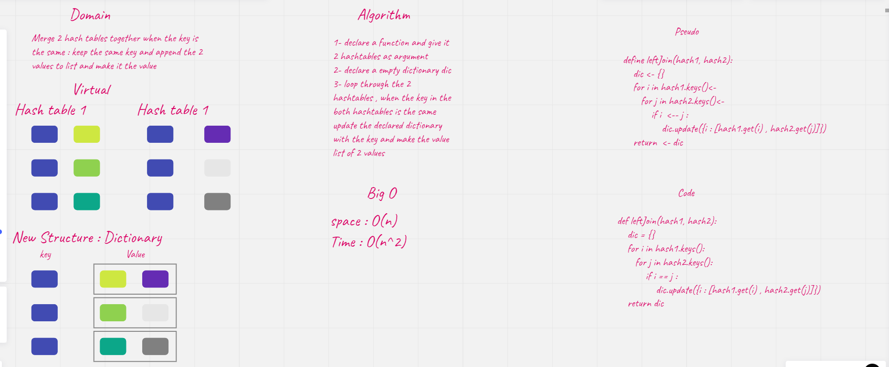

# Hashtables
- Hash - A hash is the result of some algorithm taking an incoming string and converting it into a value that could be used for either security or some other purpose. In the case of a hashtable, it is used to determine the index of the array.
- Buckets - A bucket is what is contained in each index of the array of the hashtable. Each index is a bucket. An index could potentially contain multiple key/value pairs if a collision occurs.
- Collisions - A collision is what happens when more than one key gets hashed to the same location of the hashtable.

## Challenge
Implement a Hashtable Class with the following methods:

- set
    - Arguments: key, value
    - Returns: nothing
    - This method should hash the key, and set the key and value pair in the table, handling collisions as needed.
    - Should a given key already exist, replace its value from the value argument given to this method.
- get
    - Arguments: key
    - Returns: Value associated with that key in the table
- contains
    - Arguments: key
    -Returns: Boolean, indicating if the key exists in the table already.
- keys
    - Returns: Collection of keys
- hash
    - Arguments: key
    - Returns: Index in the collection for that key
## Approach & Efficiency
| method      | space | Time |
|--------------|:-----:|-----------:|
| set |  O(1)|        O(1) |
| get      |  O(1) |          O(n) |
| contains |  O(1)|        O(1) |
|  hash     |  O(1) |          O(n) |

## API
- set
    - When adding a new key/value pair to a hashtable:

        - send the key to the `get` method.
        - Once you determine the index of where it should be placed, go to that index
        - Check if something exists at that index already, if it doesn’t, add it with the key/value pair.
        - If something does exist, add the new key/value pair to the data structure within that bucket.

- get , hash 
    - The GetHash will accept a key as a string, conduct the hash, and then return the index of the array where the key/value should be placed.

 - contains
    - The Contains method will accept a key, and return a bool on if that key exists inside the hashtable. The best way to do this is to have the contains call the `get` and check the hashtable if the key exists in the table given the index returned.

____
____

# Hashmap LEFT JOIN

- Write a function called left join
- Arguments: two hash maps
    - The first parameter is a hashmap that has word strings as keys, and a synonym of the key as values.
    - The second parameter is a hashmap that has word strings as keys, and antonyms of the key as values.
- Return: The returned data structure that holds the results is up to you. It doesn’t need to exactly match the output below, so long as it achieves the LEFT JOIN logic

## Challenge
- [Code](./hashtable/hashtable.py)
- [Test](./tests/test_hashtable.py)

## Approach & Efficiency
- space : O(n) 
- Time : O(n^2)

## Solution

